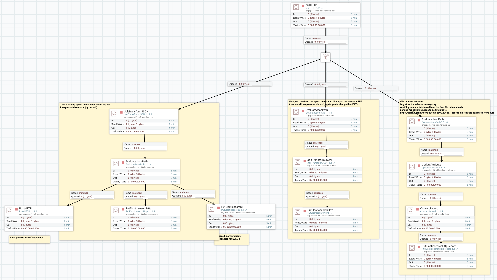
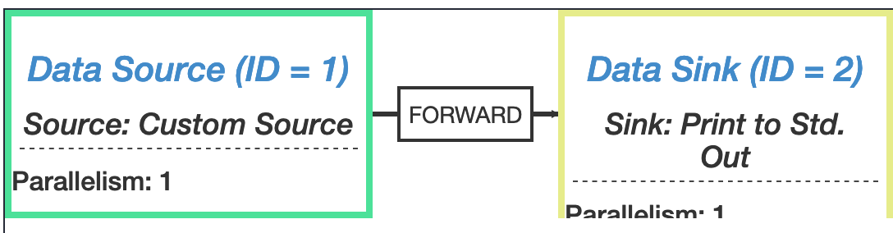

[](https://travis-ci.com/geoHeil/streaming-reference)

# streaming reference example

Streaming reference example with Avro, SchemaRegistry, NiFi, NiFi registry, Kafka/Pulsar, Elastic & Kibana and Flink.

Where a rasperry pi actas as a sensor.


The NiFi flows are version controlled using GIT and can be found in a separate repository.

## steps:

```bash
git clone https://github.com/geoHeil/flow_storage
docker-compuse up
```

- Kibana localhost:5601
- NiFi localhost:8080/nifi/
- NiFi registry localhost:18080/nifi-registry
- Schema registry localhost:8081
- Confluent control center http://localhost:9021
- Flink localhost:8082
- zookeeper localhost:8081

- Elastic localhost:9200
- broker
    - kafka: localhost:29092 and localhost:9092
    - pulsar

## steps

### nifi stuff
- in registry create a test bucket
- in NiFi connect the registry in the controller settings
    - http://registry:18080
- create a processor & group
- version control

### initial kafka example
- https://towardsdatascience.com/big-data-managing-the-flow-of-data-with-apache-nifi-and-apache-kafka-af674cd8f926

- follow along and set-up NiFi
- then prepare kafka

```bash
docker-compose exec broker \
    kafka-topics --create --topic test --partitions 1 --replication-factor 1 --if-not-exists --zookeeper zookeeper:2181

docker-compose exec broker \
    kafka-topics --create --topic tweets-raw --partitions 1 --replication-factor 1 --if-not-exists --zookeeper zookeeper:2181

docker-compose exec broker  \
    kafka-topics --describe --topic test --zookeeper zookeeper:2181

docker-compose exec broker  \
    kafka-console-consumer --bootstrap-server localhost:29092 --topic test --from-beginning --max-messages 30

docker-compose exec broker  \
    kafka-console-consumer --bootstrap-server localhost:29092 --topic tweets-raw --from-beginning --max-messages 30
```

- let the messages flow

### NiFi bitcoins example

We want to create the following workflow:

- read from REST API
- push to Elastic
- visualize

for 3x i.e. sometiems using Avro schemata, sometimes not, sometimes cleanig up data types in NiFi or directly in Elasticsearch.

The overall picture looks like this:



let's get started.

1. Connect to registry
2. import processor groups from the registry
3. examine workflows & click play for all (of the bitconi related stuff)

**setup of controller services**

Controller services might be disabled after importing the processor group from the registry. Enable them!

> For the HTTPS trust store service set the default password to: `changeit` in case NiFi complains about a missing or unreadable password.

<details>
<summary>JOLT example</summary>
<br>
JOLT mode is chain.
<br><br>

For a spec of:

```
[{
  "operation": "shift",
  "spec": {
    "timestamp" : "timestamp",
  	"last" : "last",
  	"volume" : "volume"
 }
 
},
{
  "operation": "modify-overwrite-beta",
  "spec": {
    "last": "=toDouble",
    "volume": "=toDouble",
   "timestamp": "${timestamp:append('000'):format('yyyy-MM-dd HH:mm:ss.SSS')}"
  }
}]
```

and input of:

```
{
	"high": "9566.53",
	"last": "9437.12",
	"timestamp": "1592464384",
	"bid": "9430.99",
	"vwap": "9414.02",
	"volume": "5071.24329638",
	"low": "9230.32",
	"ask": "9437.14",
	"open": "9459.82"
}
```

the data is cleaned up and transformed nicely.
</details>

### Elastic stuff

Now go to kibana and create an indexing pattern for both document types.

#### Avro

```
GET _cat/indices
GET fixed-bitstamp*/_search
GET bitstamp*/_search
GET avro-bitstamp*/_search

GET fixed-bitstamp*/_mapping
GET bitstamp*/_mapping
GET avro-bitstamp*/_mapping
```


##### types fixup

If not cleaned up below can be used to fix the data types directly in Elastic:

```
PUT _template/bits_template
{
  "index_patterns": "bits*",
  "order": 1,
  "mappings": {
     "properties": {
      "reindexBatch": {
        "type": "text",
        "fields": {
          "keyword": {
            "type": "keyword",
            "ignore_above": 256
          }
        }
      },
      "last": {
        "type": "float"
      },
      "timestamp": {
        "type": "date",
        "format":
          "epoch_second"
      },
      "volume": {
        "type": "float"
      }
    }
  }
}

# template only applied to new ones - delete old ones
DELETE bits*

# alternatively reindex
POST _reindex
{
  "source": {
    "index": "twitter"
  },
  "dest": {
    "index": "new_twitter"
  }
}
```

#### Cleaning up in Elastic

```
DELETE bitstamp*
DELETE fixed-bitstamp-*
```

### tweets example

enter twitter API credentials

using a JOLT of:

```
[{
  "operation": "shift",
  "spec": {
    "id_str" : "tweet_id",
    "text" : "text",
    "source" : "source",
    "geo": "geo",
    "place": "place",
    "lang": "lang",
    "created_at":"created_at",
    "timestamp_ms":"timestamp_ms",
    "coordinates":"coordinates",
    "user": {
      "id": "user_id",
      "name": "user_name",
      "screen_name": "screen_name",
      "created_at": "user_created_at",
      "followers_count": "followers_count",
      "friends_count" : "friends_count",
      "lang":"user_lang",
      "location": "user_location"
    },
    "entities": {
      "hashtags" : "hashtags"
    }
 }
}]
```
to reshape the tweets, we can define an Avro Schema in Confluent registry:

```
{
    "type": "record",
    "name": "nifiRecord",
    "namespace": "org.apache.nifi",
    "fields": [
        {
            "name": "tweet_id",
            "type": [
                "null",
                "string"
            ]
        },
        {
            "name": "text",
            "type": [
                "null",
                "string"
            ]
        },
        {
            "name": "source",
            "type": [
                "null",
                "string"
            ]
        },
        {
            "name": "geo",
            "type": [
                "null",
                "string"
            ]
        },
        {
            "name": "place",
            "type": [
                "null",
                "string"
            ]
        },
        {
            "name": "lang",
            "type": [
                "null",
                "string"
            ]
        },
        {
            "name": "created_at",
            "type": [
                "null",
                "string"
            ]
        },
        {
            "name": "timestamp_ms",
            "type": [
                "null",
                "string"
            ]
        },
        {
            "name": "coordinates",
            "type": [
                "null",
                "string"
            ]
        },
        {
            "name": "user_id",
            "type": [
                "null",
                "long"
            ]
        },
        {
            "name": "user_name",
            "type": [
                "null",
                "string"
            ]
        },
        {
            "name": "screen_name",
            "type": [
                "null",
                "string"
            ]
        },
        {
            "name": "user_created_at",
            "type": [
                "null",
                "string"
            ]
        },
        {
            "name": "followers_count",
            "type": [
                "null",
                "long"
            ]
        },
        {
            "name": "friends_count",
            "type": [
                "null",
                "long"
            ]
        },
        {
            "name": "user_lang",
            "type": [
                "null",
                "string"
            ]
        },
        {
            "name": "user_location",
            "type": [
                "null",
                "string"
            ]
        },
        {
            "name": "hashtags",
            "type": [
                "null",
                {
                    "type": "array",
                    "items": "string"
                }
            ]
        }
    ]
}
```

To view all the subjects registered in Schema Registry (assuming Schema Registry is running on the local machine listening on port 8081):

```
curl --silent -X GET http://localhost:8081/subjects/ | jq .
```

Nothing there yet. Let's upload a schema:

```
curl -X POST -H "Content-Type: application/vnd.schemaregistry.v1+json" --data common/models/src/main/avro/Tweet.avsc http://localhost:8081/subjects/tweets/versions

curl -X POST -H "Content-Type: application/vnd.schemaregistry.v1+json" -d @common/models/src/main/avro/Tweet.avsc http://localhost:8081/subjects/tweets/versions
```

To view the latest schema for this subject in more detail:

```
curl --silent -X GET http://localhost:8081/subjects/tweets-raw-value/versions/latest | jq .
```

Now, write to kafka. Create a partition:

```
docker-compose exec broker \
    kafka-topics --create --topic tweets-raw --partitions 1 --replication-factor 1 --if-not-exists --zookeeper zookeeper:2181

docker-compose exec broker \
    kafka-topics --delete --topic tweets-raw --zookeeper zookeeper:2181

docker-compose exec broker  \
    kafka-topics --describe --topic tweets-raw --zookeeper zookeeper:2181

docker-compose exec broker  \
    kafka-console-consumer --bootstrap-server localhost:29092 --topic tweets-raw --from-beginning --max-messages 30
```

#### a minimalistic kafacat example

```
docker-compose exec broker \
    kafka-topics --create --topic hello-streams --partitions 1 --replication-factor 1 --if-not-exists --zookeeper zookeeper:2181

kafkacat -C -b localhost:9092 -t hello-streams #starts listener
kafkacat -P -b localhost:9092 -t hello-streams #starts producer

## type along to produce some messages
```

Now start an interactive flink shell somewhere.

Be sure to take care of:

- scala 2.11 (not 2.12): https://stackoverflow.com/questions/54950741/flink-1-7-2-start-scala-shell-sh-cannot-find-or-load-main-class-org-apache-flink
- as all the kafka and other docker containers have a clashing port range with flink`s default settings, please change: 

```
vi conf/flink-conf.yaml

# and set:
rest.port: 8089
```

- fix outdated JLine version in Terminal https://stackoverflow.com/questions/62370582/flink-start-scala-shell-numberformat-exepction by setting: `export TERM=xterm-color`
- download the kafka jar additional JAR (https://stackoverflow.com/questions/55098192/read-from-kafka-into-flink-scala-shell):

```bash
wget https://repo1.maven.org/maven2/org/apache/flink/flink-connector-kafka_2.11/1.10.1/flink-connector-kafka_2.11-1.10.1.jar -P lib/

wget https://repo1.maven.org/maven2/org/apache/flink/flink-connector-kafka-base_2.11/1.10.1/flink-connector-kafka-base_2.11-1.10.1.jar -P lib/

wget https://repo1.maven.org/maven2/org/apache/kafka/kafka-clients/0.10.2.1/kafka-clients-0.10.2.1.jar -P lib/
```

- finally start a local scala flink shell in 2.11:

```bash
export TERM=xterm-color
./bin/start-scala-shell.sh local
```

We should see the squirrel and should be able to type some code. Additionally: http://localhost:8089 should provide the Flink UI:

```scala
import java.util.Properties
import org.apache.flink.streaming.api.scala._
import org.apache.flink.streaming.connectors.kafka.{FlinkKafkaConsumer, FlinkKafkaProducer}
import org.apache.flink.api.common.serialization.SimpleStringSchema

val properties = new Properties()
properties.setProperty("bootstrap.servers", "localhost:9092")
properties.setProperty("group.id", "test")
properties.setProperty("auto.offset.reset", "earliest")

val stream = senv.addSource[String](new FlinkKafkaConsumer("hello-streams", new SimpleStringSchema(), properties))
stream.print

senv.execute("Kafka Consumer Test")
```

To run it programmatically:

```
make run-local-TweetsMinimalistic01
```

take the output from there

```
{"nodes":[{"id":1,"type":"Source: Custom Source","pact":"Data Source","contents":"Source: Custom Source","parallelism":1},{"id":2,"type":"Sink: Print to Std. Out","pact":"Data Sink","contents":"Sink: Print to Std. Out","parallelism":1,"predecessors":[{"id":1,"ship_strategy":"FORWARD","side":"second"}]}]}
```

and paste it to https://flink.apache.org/visualizer/. The result should be similar to:


#### Confluent Schema registry interactive

- let's add some more missing JARs:

```bash
wget https://repo1.maven.org/maven2/org/apache/flink/flink-avro-confluent-registry/1.10.1/flink-avro-confluent-registry-1.10.1.jar -P lib/
wget https://repo1.maven.org/maven2/org/apache/flink/flink-avro/1.10.1/flink-avro-1.10.1.jar -P lib/

wget https://repo1.maven.org/maven2/org/apache/flink/force-shading/1.10.1/force-shading-1.10.1.jar -P lib/
wget https://repo1.maven.org/maven2/org/apache/avro/avro/1.8.2/avro-1.8.2.jar -P lib/
```

- now start the shell again

```bash
export TERM=xterm-color
./bin/start-scala-shell.sh local
```

- and execute

```scala
import org.apache.flink.streaming.connectors.kafka.{
  FlinkKafkaConsumer,
  FlinkKafkaProducer
}
import org.apache.flink.formats.avro.registry.confluent.ConfluentRegistryAvroDeserializationSchema
import java.util.Properties

senv.enableCheckpointing(5000)

// TODO add generate tweet class. Make sure to generate a specific schema

val properties = new Properties()
properties.setProperty("bootstrap.servers", "localhost:9092")
properties.setProperty("group.id", "test")
val schemaRegistryUrl = "http://localhost:8081"
val serializer = ConfluentRegistryAvroDeserializationSchema.forSpecific[Tweet](classOf[Tweet], schemaRegistryUrl)

val stream = senv.addSource(
    new FlinkKafkaConsumer(
      "tweets-raw",
      serializer,
      properties
    ).setStartFromEarliest() // TODO experiment with different start values
  )

stream.print
senv.execute("Kafka Consumer Test")
```

### minifi

TODO

### kafka connect

TODO

### elastic

- https://github.com/tjaensch/nifi_docker_elasticsearch_demo
- https://linkbynet.github.io/elasticsearch/tuning/2017/02/07/Bitcoin-ELK-NiFi.html

### kibana

TODO

### pulsar

TODO


### schema registry (hortonworks)

TODO including custom docker image, no SASL

### egeria

TODO atlas egeria

### neo4j

https://community.neo4j.com/t/nifi-goes-neo/11262/6

### nifi improve

data sample flows:

- https://www.youtube.com/watch?v=QJqUpfAy6w4

improvements:

- variables in workflows
- tags
- monitoring
- site2site
- rules engine http://lonnifi.blogspot.com/

### flink job

#### aggregation

#### hive integration 


## other good examples

Or simply other ideas for nice data to stream in this pipeline:

- https://github.com/asdaraujo/edge2ai-workshop
- https://www.youtube.com/watch?v=gR2vGKiDrqo&t=2196s
- https://github.com/BrooksIan/Flink2Kafka